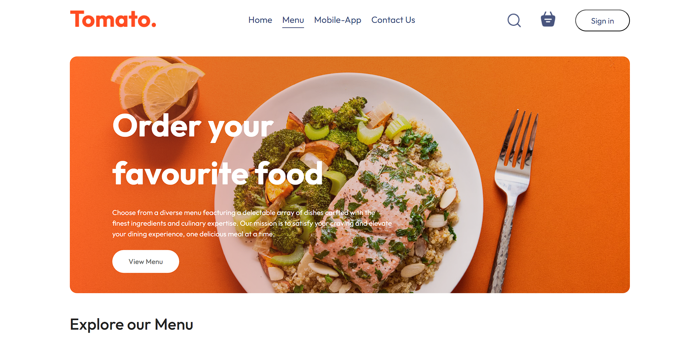

#Deployment
----How To Deploy----

cd File name
 
npm run dev
 
Then Go To Address Link

# My Project

Here’s an overview of my project.

## Features

- Enhanced User Engagement: Tailoring recommendations to user preferences increases the likelihood of repeat orders and customer loyalty.
- Increased Sales: Personalized suggestions can highlight popular or new items, encouraging users to try different dishes or upgrade their orders.
- Improved User Experience: Making it easier for users to discover new favorites or find their go-to dishes simplifies their decision-making process.

# React + Vite

This template provides a minimal setup to get React working in Vite with HMR and some ESLint rules.

Currently, two official plugins are available:

- [@vitejs/plugin-react](https://github.com/vitejs/vite-plugin-react/blob/main/packages/plugin-react/README.md) uses [Babel](https://babeljs.io/) for Fast Refresh
- [@vitejs/plugin-react-swc](https://github.com/vitejs/vite-plugin-react-swc) uses [SWC](https://swc.rs/) for Fast Refresh
